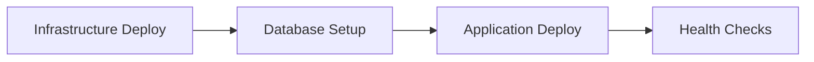

# OC Infrastructure

The **OC Infrastructure** repository is the centralized hub for managing the Kubernetes-based infrastructure that powers the OC project ecosystem. This repository provides automated deployment, local development environments, and production-ready infrastructure patterns for a multi-tenant application architecture.

## 🏗️ Project Architecture

The OC project consists of **4 application repositories** deployed on a shared Kubernetes infrastructure:

### Application Repositories
- **[oc-provider-frontend](https://github.com/julienreichel/oc-provider-frontend)** - Vue.js + Quasar frontend for provider services
- **[oc-provider-backend](https://github.com/julienreichel/oc-provider-backend)** - NestJS API backend for provider operations  
- **[oc-client-frontend](https://github.com/julienreichel/oc-client-frontend)** - Vue.js + Quasar frontend for client services
- **[oc-client-backend](https://github.com/julienreichel/oc-client-backend)** - NestJS API backend for client operations

### Infrastructure Components (This Repository)
- **Kubernetes Orchestration** - Namespace isolation, service mesh, and resource management
- **Ingress & Routing** - Traefik-based traffic management with automatic TLS
- **Database Infrastructure** - PostgreSQL deployment with Helm charts
- **Certificate Management** - Let's Encrypt integration via cert-manager
- **CI/CD Automation** - GitHub Actions workflows for deployment orchestration
- **Local Development Environment** - k3d-based local Kubernetes clusters

## 🎯 Infrastructure Overview

### Multi-Namespace Architecture
```
oc-gateway/        # Shared infrastructure (Traefik, cert-manager)
├── oc-provider/   # Provider application services & database
└── oc-client/     # Client application services & database
```

### Traffic Flow
```
Internet → Traefik (oc-gateway) → Application Services
├── provider.on-track.ch → oc-provider namespace
└── client.on-track.ch   → oc-client namespace
```

### Technology Stack
- **Platform**: Kubernetes (Infomaniak Public Cloud + k3d local)
- **Ingress**: Traefik Controller with automatic TLS termination
- **Certificates**: cert-manager + Let's Encrypt (ACME HTTP-01)
- **Database**: PostgreSQL via Bitnami Helm charts
- **Container Registry**: GitHub Container Registry (GHCR)
- **Infrastructure as Code**: Helm charts + kubectl manifests
- **CI/CD**: GitHub Actions with matrix deployment strategy

## 🚀 Quick Start

### Prerequisites
```bash
# Install required tools
brew install git node docker kubectl helm

# Verify installations
kubectl version --client
helm version
docker --version
```

### Local Development Setup
```bash
# Clone this infrastructure repository
git clone https://github.com/julienreichel/oc-infra.git
cd oc-infra

# Start local Kubernetes environment
./scripts/setup-local.sh

# Check environment status
./scripts/dev-status.sh
```

### Configure Local DNS
Add to your `/etc/hosts`:
```
127.0.0.1  provider.localhost
127.0.0.1  client.localhost
```

### Access Applications
- **Provider**: https://provider.localhost
- **Client**: https://client.localhost

## 📁 Repository Structure

```
oc-infra/
├── .github/workflows/     # CI/CD automation
│   └── cicd.yml          # Multi-environment deployment pipeline
├── k8s/                  # Kubernetes manifests
│   ├── namespace.yaml    # Namespace definitions
│   ├── clusterissuer-*.yaml  # Certificate issuers
│   ├── local-ingress-*.yaml  # Local development routing
│   └── *-dev-svc.yaml   # Development service configurations
├── scripts/              # Development & deployment scripts
│   ├── setup-local.sh    # Local environment initialization
│   ├── dev-status.sh     # Environment status checker
│   ├── dev-start.sh      # Start local cluster
│   ├── dev-stop.sh       # Stop local cluster
│   ├── redeploy-apps.sh  # Application redeployment
│   └── use-*-*.sh        # Service switching utilities
├── INSTALL_STEP.md       # Detailed setup instructions
├── KNOWLEDGE_BASE.md     # Architecture documentation
└── README.md            # This file
```

## 🔧 Development Workflow

### 1. Infrastructure Setup
The infrastructure repository handles all Kubernetes resources:
- Namespaces and RBAC
- Ingress controllers and routing rules  
- Database provisioning and configuration
- Certificate management and TLS termination
- Service discovery and networking

### 2. Application Development
Each application repository focuses on business logic:
- Builds and pushes container images
- Contains Kubernetes deployment manifests
- Manages application-specific configurations
- Handles database migrations and seed data

### 3. Deployment Pipeline


### 4. Local Development Commands

```bash
# Environment Management
./scripts/setup-local.sh      # Initialize local K8s cluster
./scripts/dev-status.sh       # Check all service status
./scripts/dev-stop.sh         # Stop local environment
./scripts/teardown-local.sh   # Complete cleanup

# Service Management  
./scripts/use-local-provider-frontend.sh   # Switch to local frontend development
./scripts/use-k8s-provider-backend.sh      # Use cluster backend service
./scripts/redeploy-apps.sh                 # Redeploy all applications
```

## 🏭 Production Infrastructure

### Automated Deployment
The CI/CD pipeline automatically deploys infrastructure changes:

1. **Namespace Provisioning** - Creates isolated environments
2. **Secret Management** - Handles registry credentials and configuration  
3. **Infrastructure Setup** - Deploys Traefik, cert-manager, PostgreSQL
4. **Application Coordination** - Triggers application deployments
5. **Health Validation** - Verifies deployment success

### Environment Matrix
- **Production**: `oc-provider`, `oc-client` namespaces
- **Development**: `oc-dev-provider`, `oc-dev-client` namespaces

### Security & Compliance
- TLS termination with automatic certificate renewal
- Container registry authentication per namespace
- Network policies for service isolation
- Secret management for sensitive configuration

## 🔍 Monitoring & Debugging

### Status Checking
```bash
# Comprehensive environment status
./scripts/dev-status.sh

# Kubernetes resource inspection  
kubectl get pods,svc,ingress --all-namespaces
kubectl describe ingress -n oc-provider
kubectl logs -l app=oc-provider-backend -n oc-provider
```

### Common Issues & Solutions
- **Certificate Issues**: Check cert-manager logs and ACME challenges
- **Ingress Routing**: Verify DNS resolution and Traefik configuration  
- **Database Connectivity**: Ensure PostgreSQL pods are ready and secrets exist
- **Service Communication**: Use internal service DNS names for pod-to-pod communication

## 📚 Documentation

- **[INSTALL_STEP.md](./INSTALL_STEP.md)** - Detailed setup instructions for production deployment
- **[KNOWLEDGE_BASE.md](./KNOWLEDGE_BASE.md)** - Architecture deep-dive and component interactions
- **Application Repositories** - Individual README files for application-specific setup

## 🤝 Contributing

### Infrastructure Changes
1. Make changes in this repository for Kubernetes manifests, scripts, or CI/CD
2. Test locally with `./scripts/setup-local.sh`
3. Verify with `./scripts/dev-status.sh`
4. Submit PR for review

### Application Changes  
1. Develop in respective application repositories
2. Use local infrastructure for testing
3. Applications deploy automatically via their own CI/CD

### Development Environment
The local environment mirrors production exactly:
- Same Helm charts and configurations
- Identical service communication patterns  
- Consistent deployment procedures
- Full TLS certificate chain (self-signed locally)

---

**🎯 This repository is your starting point for OC infrastructure development.** All Kubernetes resources, deployment automation, and local development environments are managed here, while application logic resides in the dedicated frontend and backend repositories.